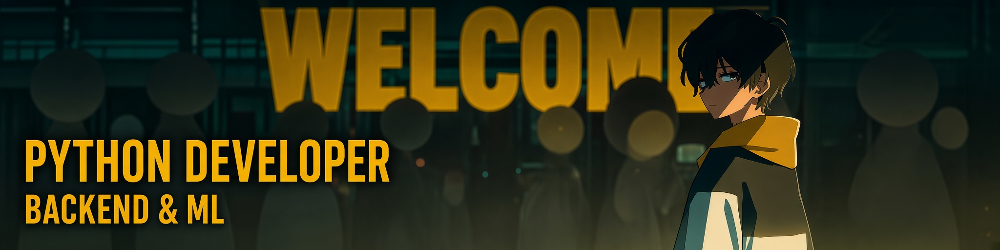

  

---

## About

Middle Python backend developer with 3+ years of experience designing and scaling RESTful APIs
with Django and FastAPI. Bachelor's in Applied Informatics, currently pursuing a Master's in
Machine Learning.

- Built an AI-enrichment integration with an external LLM API that lifted SEO metadata coverage
  across the media catalog to 95%.
- Resolved a Celery task-queue bottleneck by deduplicating tasks and reworking the worker
  architecture, cutting report generation time from 2 minutes to 0.2 seconds.

Looking for a scalable project where I can see my own impact on a system used by real people.

## Skills

| Category | |
|---|---|
| **Languages** |   |
| **Frameworks** |       |
| **Databases & Messaging** |           |
| **ML & Data Science** |         |
| **Infra & DevOps** |            |
| **Developer Tools** |   |
| **AI Tools** |   |

## Experience

**Nalitek** &nbsp;·&nbsp; Python Backend Developer &nbsp;·&nbsp; 2023 – 2026
> Analytics infrastructure and event-driven pipelines for high-load media platforms — ClickHouse,
> Kafka, and AI-assisted content enrichment.

**Contentline** &nbsp;·&nbsp; QA Engineer → Python Backend Developer &nbsp;·&nbsp; 2022 – 2023
> Web platforms for corporate clients — test automation, then backend feature work and
> performance tuning.

## Projects

**[rush-hour-flows](https://github.com/i-safonoff/rush-hour-flows)**
> Predicting peak-hour taxi demand and trip duration between Moscow districts with CatBoost,
> and quantifying the revenue lost to surge-driven cancellations.

**[dnd_assistant_rag](https://github.com/i-safonoff/dnd_assistant_rag)**
> Local RAG assistant for tabletop rulebooks, powered by a self-hosted Qwen model via vLLM.

**[quadcopter-hil-simulator](https://github.com/i-safonoff/quadcopter-hil-simulator)**
> Hardware-in-the-loop quadcopter flight-control simulator — Qt/OpenGL ground station paired
> with STM32F411 firmware.

## Hackathons

| Year | Hackathon | Result | Link |
|---|---|---|---|
| | | | |

## Education

| Institution | Degree | Dates |
|---|---|---|
| Central University | Master's, Machine Learning in Computer Science | Sept 2025 – Present |
| Bauman Moscow State Technical University | Bachelor's, Applied Informatics | Sept 2021 – Aug 2025 |

## Certificates

| Certificate | Issuer | Date | Link |
|---|---|---|---|
| AI Agents Security Week (intensive course) | Yandex School of Data Analysis | Jul 2026 | [certificate](documents/AIWEEK_Certificate.pdf) |

---

*Open to backend engineering opportunities and interesting collaborations*

